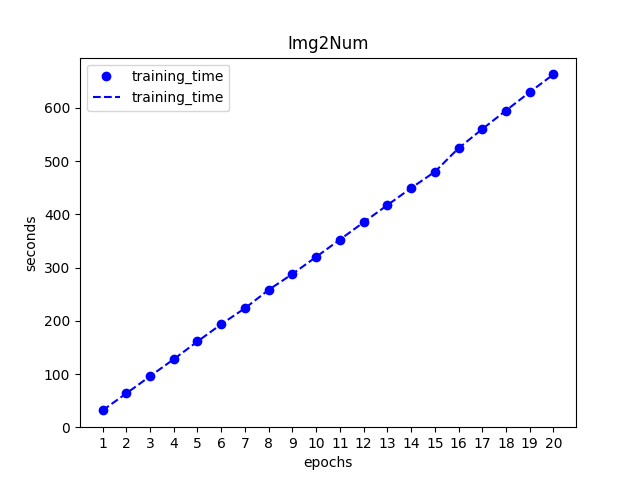
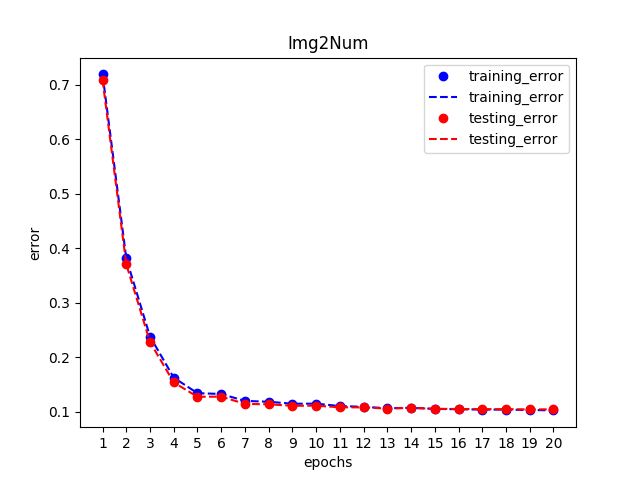
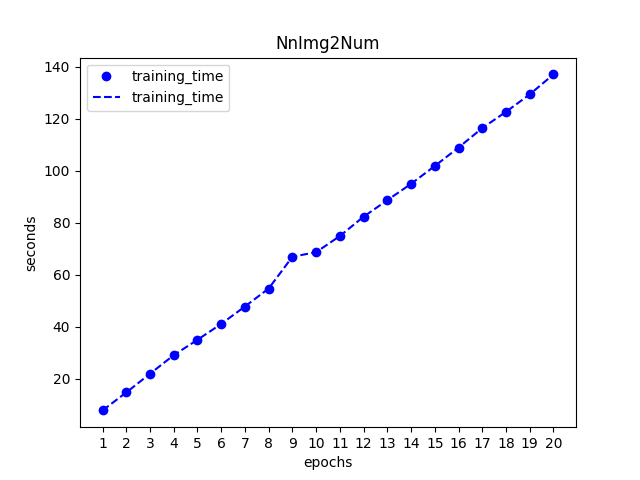
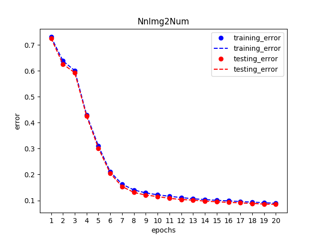
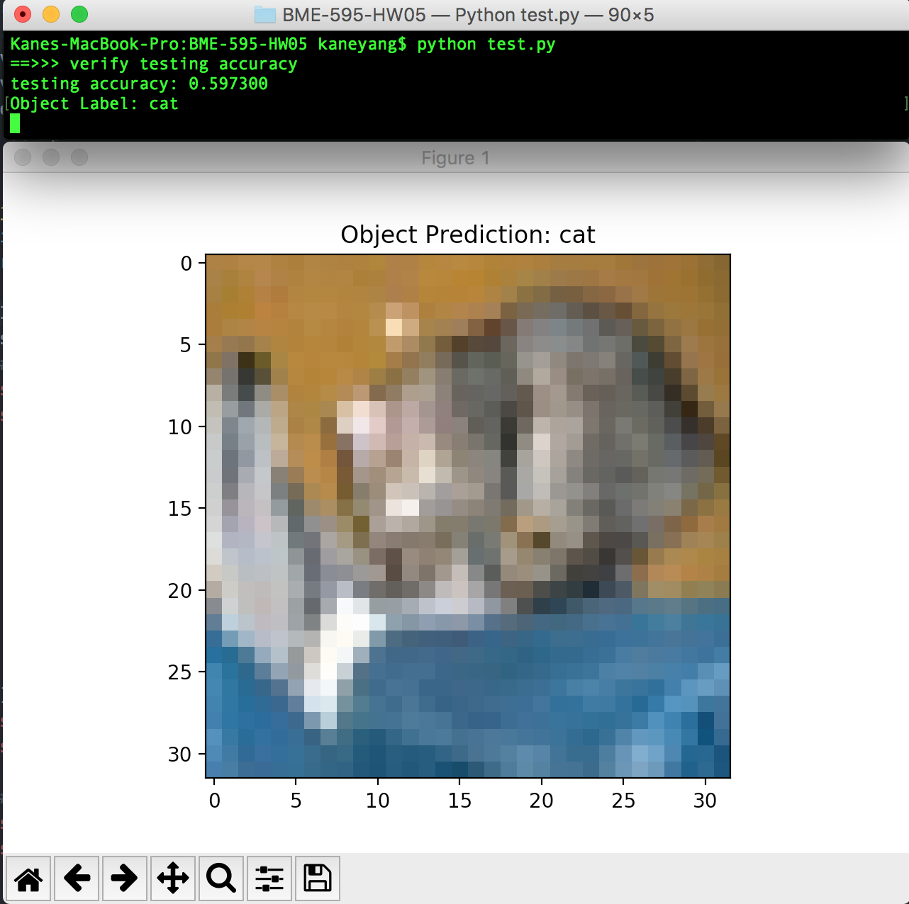
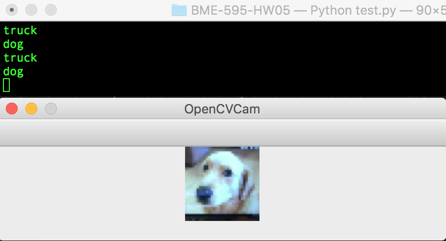

# BME-595 Assignment 05

## img2num
The following are the training time and training error for LeNet-5 model using MNIST dataset
### Training time

### Training/Testing error

The following are the training time and training error for homework 4 model using MNIST dataset
### Training time

### Training/Testing error

## img2obj
For CIFAR-100, the accuracy is still only 18.56% after 150 training epochs in my implementation; For CIFAR-10, the accuracy can reach 59.73% after simply 50 training epochs.

The following is a running example of Img2obj.view() function. The function displayed a 32x32 image and predicted the image as a "cat" object.

The following is a running example of Img2obj.cam() function. The last line "dog" in the terminal means the function detected a "dog"-like object in front of the webcam.

